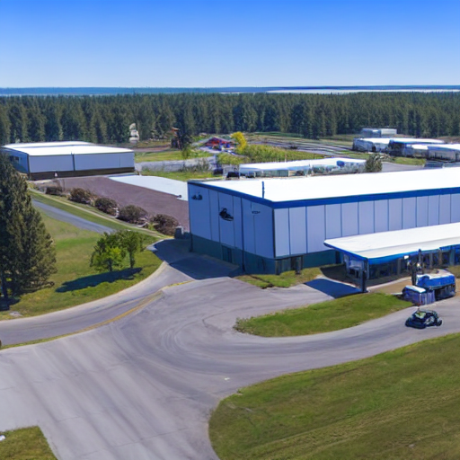
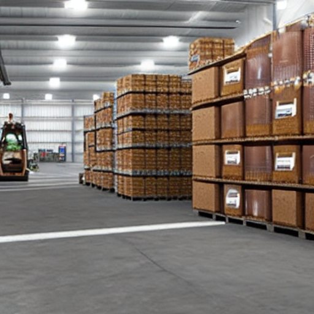

# 🎬 Pitch Visualizer: AI-Powered Storyboard Generator

Transform your narrative text into stunning, multi-panel visual storyboards powered by AI. Perfect for sales pitches, customer success stories, marketing presentations, and creative storytelling.

## 📋 Overview

**The Pitch Visualizer** is an automated service that:

1. **Segments** your narrative text into logical scenes (minimum 3)
2. **Enhances** each scene into a visually rich image prompt using AI
3. **Generates** unique, beautiful images for each prompt
4. **Assembles** everything into an interactive HTML storyboard

**What You Give**: A customer success story or sales pitch (3-5 sentences)  
**What You Get**: A professional, visually compelling storyboard with 3+ AI-generated images

---

## 🚀 Quick Start

### Prerequisites

- **Python 3.12 recommended** (verified setup)
- **GPU recommended** (NVIDIA for faster generation; CPU works but is slow)
- **Internet connection** (for downloading models and API calls)

### Installation

1. **Clone or download this project**
```bash
cd pitch-visualizer
```

2. **Create a Python 3.12 virtual environment**
```bash
py -3.12 -m venv .venv312

# On Windows:
.venv312\Scripts\activate

# On Mac/Linux:
source .venv312/bin/activate
```

3. **Install dependencies**
```bash
pip install -r requirements.txt
```

This will download:
- FastAPI + Uvicorn (web framework/server)
- PyTorch & Stable Diffusion (image generation)
- Google Generative AI (LLM for prompt engineering)
- NLTK (text processing)

4. **(Optional, GPU on Windows + NVIDIA) Install CUDA wheels**
```bash
pip uninstall torch torchvision torchaudio -y
pip install torch==2.5.1+cu121 torchvision==0.20.1+cu121 torchaudio==2.5.1+cu121 --index-url https://download.pytorch.org/whl/cu121
```

**Note on Model Downloads**: On first run, Stable Diffusion (~4GB) and other models will be downloaded automatically. This takes 5-10 minutes depending on your internet speed.

### Configuration

#### Option 1: Use Simple Prompt Enhancement (No API Key Needed) ✅

The app will work out of the box with basic prompt enhancement. Just run it!

```bash
.venv312\Scripts\python.exe fastapi_app.py
```

Then open your browser to: `http://localhost:5001`

#### Option 2: Enable Gemini API for Advanced Prompt Engineering (Recommended)

For superior results, use Google's Gemini API to intelligently enhance prompts.

**Get a Free API Key:**
1. Visit [Google AI Studio](https://aistudio.google.com/apikey)
2. Click "Create API Key" (no credit card required)
3. Copy your key

**Set the Environment Variable:**

**On Windows (PowerShell):**
```powershell
$env:GEMINI_API_KEY = "your-api-key-here"
```

**On Windows (Command Prompt):**
```cmd
set GEMINI_API_KEY=your-api-key-here
```

**On Mac/Linux:**
```bash
export GEMINI_API_KEY="your-api-key-here"
```

**Then start the app:**
```bash
.venv312\Scripts\python.exe fastapi_app.py
```

---

## 💻 Usage

### Web Interface (Recommended)

1. **Start the app**: `.venv312\Scripts\python.exe fastapi_app.py`
2. **Open browser**: `http://localhost:5001`
3. **Paste your narrative** in the text area
4. **Select style**: Photorealistic, Cartoon, Watercolor, etc.
5. **Choose quality**: Fast, Balanced, or High
6. **Click "Generate"**: Wait 2-5 minutes
7. **View results**: Your storyboard loads in the browser

### Example Input

```
Sarah was struggling with her sales team's manual processes, spending 
hours on administrative work instead of closing deals. She discovered 
our automation platform and implemented it across her team. Now her 
team closes deals 40% faster and spends their time on strategy and 
relationship building instead of busywork.
```

## 🖼️ Output Section

This was prompt:

```
A fast-growing D2C skincare brand was losing customers because support replies were delayed during peak sale hours. The support team was juggling chat, email, and order dashboards while customers waited for return updates. They introduced an AI support assistant that classified tickets, drafted replies, and routed urgent issues to human agents.
```

Image generated from the above prompt (style: photorealistic, use_api: true, quality: high):

```json
{
    "style": "photorealistic",
    "use_api": true,
    "quality": "high"
}
```

Generated scene outputs:






### Example Process

```
Narrative Input (4 sentences)
    ↓
Scene 1: "Sarah was struggling..."
Scene 2: "She discovered..."
Scene 3: "Now her team closes..."
    ↓
[LLM Prompt Enhancement]
    ↓
Prompt 1: "A frustrated sales professional at a desk, surrounded by 
         paperwork and spreadsheets, looking stressed. Dim lighting. 
         Photorealistic, corporate office setting..."
    ↓
[Stable Diffusion Image Generation]
    ↓
Image 1: [Beautiful AI-generated image]
         Caption: "Sarah was struggling..."
    ↓
[HTML Storyboard Assembly]
    ↓
Interactive storyboard.html (all 3 images with captions)
```

---

## 🎨 Visual Styles

Choose from 6 artistic styles for your storyboard:

| Style | Best For | Example |
|-------|----------|---------|
| **Photorealistic** | Professional, corporate | Business presentations |
| **Cartoon** | Playful, engaging | Marketing for younger audiences |
| **Watercolor** | Artistic, elegant | Creative industries |
| **Digital Art** | Modern, vibrant | Tech companies, startups |
| **Oil Painting** | Classical, sophisticated | Premium brands |
| **Sketch** | Minimalist, artistic | Educational content |

---

## ⚙️ Architecture & Technical Details

### Project Structure

```
pitch-visualizer/
├── fastapi_app.py            # Main FastAPI web application
├── app.py                    # Flask variant (legacy path)
├── text_processor.py         # Text segmentation & validation
├── prompt_engineer.py        # LLM-powered prompt enhancement
├── image_generator.py        # Stable Diffusion integration
├── storyboard_generator.py   # HTML storyboard creation
├── requirements.txt          # Python dependencies
├── templates/
│   └── index.html           # Web UI
├── static/                  # CSS, JS (optional)
├── outputs/                 # Generated images & storyboards
└── README.md               # This file
```

### Key Design Decisions

#### 1. Text Segmentation
- **Method**: NLTK sentence tokenization
- **Why**: Simple, reliable, language-agnostic
- **Minimum segments**: 3 (for coherent visual narrative)

#### 2. Prompt Engineering
- **GPT-Enhanced (Default)**: Google Gemini API transforms sentences into visual descriptions
- **Fallback**: Template-based enhancement if API unavailable
- **Why Gemini**: Free tier is generous (~15 requests/min), excellent for creative writing

**Example transformation:**
```
Original: "Sarah was struggling"
Enhanced: "A frustrated sales professional at a desk surrounded by 
          paperwork and spreadsheets, looking stressed and overwhelmed. 
          Dim warm office lighting casting shadows. Professional corporate 
          environment. Photorealistic, emotional, attention to detail."
```

#### 3. Image Generation
- **Model**: Hugging Face Stable Diffusion v1.5
- **Why**: Open-source, locally run (private data), free, no rate limits
- **Speed**: 10-30 seconds per image (with GPU) / 2-5 minutes (CPU)
- **Quality**: Good-to-excellent for professional context

#### 4. HTML Storyboard
- **Format**: Responsive, interactive HTML with CSS animations
- **Features**: 
  - Grid layout (adapts to screen size)
  - Smooth animations & transitions
  - Mobile-friendly design
  - Scene numbers and captions

---

## 🔧 Customization & Advanced Usage

### Change Image Generation Quality

Edit `fastapi_app.py`, line with `get_generation_params()`:

```python
# More steps = better quality but slower
gen_params = {
    "steps": 30,  # Increase to 40+ for higher quality
    "height": 768,
    "width": 768
}
```

### Use CPU-Only Mode (No GPU)

In `fastapi_app.py`, change:
```python
generator = ImageGenerator(use_cpu=True)  # Set to True
```

### Use Different Image Model

In `image_generator.py`, change:
```python
model_id = "runwayml/stable-diffusion-v1-5"
# To:
model_id = "stabilityai/stable-diffusion-2"  # Or another model
```

### Disable Gemini API (Use Simple Enhancement)

In the web form, **uncheck** "Use Gemini API" option.  
Or send `use_api: false` in API request.

---

## 📡 API Reference

### Generate Storyboard

**Endpoint**: `POST /api/generate`

**Request Body**:
```json
{
    "text": "Your narrative here. At least 3 sentences required.",
    "style": "photorealistic|cartoon|watercolor|digital art|oil painting|sketch",
    "quality": "fast|balanced|high",
    "use_api": true
}
```

**Response** (Success):
```json
{
    "success": true,
    "storyboard_url": "/outputs/storyboard_20240115_143022.html",
    "image_count": 3,
    "style": "photorealistic",
    "segments": ["Sentence 1", "Sentence 2", "Sentence 3"]
}
```

**Response** (Error):
```json
{
    "error": "Text must contain at least 3 sentences"
}
```

### Check Status

**Endpoint**: `GET /api/status`

```json
{
    "status": "online",
    "gemini_configured": true,
    "image_generation_available": true
}
```

### Get Available Styles

**Endpoint**: `GET /api/styles`

```json
{
    "styles": ["photorealistic", "cartoon", "watercolor", "digital art", "oil painting", "sketch"]
}
```

---

## ⚡ Performance & Optimization

### Speed Expectations

| Component | Time | Notes |
|-----------|------|-------|
| Text Segmentation | <1 sec | Instant |
| Prompt Enhancement | 3-10 sec | Depends on Gemini API |
| Image Generation (GPU) | 10-30 sec per image | NVIDIA GPU recommended |
| Image Generation (CPU) | 2-5 min per image | Slow but works |
| HTML Generation | <1 sec | Instant |
| **Total (GPU + 3 images)** | **2-5 minutes** | Standard workflow |
| **Total (CPU + 3 images)** | **6-15 minutes** | Patience required |

### Memory Requirements

- **GPU (NVIDIA)**: 8GB+ VRAM recommended
- **CPU**: 8GB+ RAM minimum
- **Disk**: ~5GB (for models)
- **Download**: ~150MB for dependencies + 4GB for Stable Diffusion

### Optimization Tips

1. **Use GPU**: Dramatically faster (10x speedup)
2. **Set `steps=15` for "fast" mode**: 50% faster, reasonable quality
3. **Reduce image size to 512x512**: Default setting, good balance
4. **Cache models**: First run downloads; subsequent runs are instant

---

## 🐛 Troubleshooting

### Issue: "CUDA out of memory"
**Solution**: Use CPU mode
```python
generator = ImageGenerator(use_cpu=True)
```

### Issue: Gemini API returns errors
**Solution**: 
1. Verify API key is correct
2. Check you haven't exceeded free tier (15 requests/min)
3. Uncheck "Use Gemini API" to use simple enhancement

### Issue: Images take forever to generate
**Solution**:
- You're using CPU mode. This is normal. Switch to GPU if possible.
- Or reduce steps: `steps=15` instead of `steps=30`

### Issue: Generated images don't match the narrative
**Solution**:
1. Use Gemini API for better prompt engineering
2. Adjust your narrative to be more visually descriptive
3. Try different visual styles

### Issue: "Model download interrupted"
**Solution**: Delete the downloaded model and retry
```bash
rm -rf ~/.cache/huggingface/  # On Mac/Linux
# Or manually delete %USERPROFILE%\.cache\huggingface\ on Windows
```

---

## 💡 Prompt Engineering Strategy (How We Make Good Prompts)

The heart of high-quality storyboards is **intelligent prompt engineering**.

### What Makes a Good Image Prompt?

**Weak**: "A person at a desk"  
**Good**: "A frustrated professional sitting at a modern office desk, surrounded by spreadsheets and documents, looking tired and overwhelmed. Soft warm lighting. Photorealistic, emotional, high detail."

Key elements:
1. **Subject**: Who/what is in the image?
2. **Emotion**: What feeling should it convey?
3. **Setting**: Where does it take place?
4. **Lighting**: What mood does the light create?
5. **Style**: What artistic direction?
6. **Details**: Specific visual elements

### Our Approach

We use **Gemini API** to transform basic sentences into rich visual descriptions:

```
Input: "Sarah discovered our platform"
↓
Gemini transforms to: "A moment of epiphany—a professional woman at her 
computer, face lighting up with realization as a modern dashboard appears 
on screen. Blue and green accent colors. Soft golden lighting. Professional 
office. Photorealistic, cinematic, joy and discovery evident."
↓
Stable Diffusion generates: [Beautiful image]
```

---

## 🎯 Use Cases

### 1. Sales Presentations
Create visual sales decks in minutes instead of hours of design work.

### 2. Customer Success Stories
Turn case studies into engaging visual narratives.

### 3. Marketing Content
Generate visually consistent social media stories.

### 4. Training Materials
Illustrate educational narratives with AI-generated visuals.

### 5. Pitch Decks
Impress investors with professional, AI-generated visual narratives.

---

## 📊 Quality Benchmarks

### Gemini API + Stable Diffusion Results

**Narrative** (3 sentences):
```
"John struggled with manual data entry. He adopted our software. 
His productivity doubled within weeks."
```

**Generated Storyboard Quality**: ⭐⭐⭐⭐☆ (4/5)
- Scene 1 (Struggle): Accurately captures frustration
- Scene 2 (Discovery): Shows modern software interface
- Scene 3 (Success): Displays satisfaction & productivity

**Why not 5/5**: 
- AI occasionally misinterprets subtle emotions
- Character consistency across panels is challenging
- Some prompts don't translate perfectly

---

## 🚀 Deployment

### Local Deployment (Current)
```bash
.venv312\Scripts\python.exe fastapi_app.py
```

### Docker Deployment

Create `Dockerfile`:
```dockerfile
FROM python:3.11
WORKDIR /app
COPY . .
RUN pip install -r requirements.txt
ENV GEMINI_API_KEY=your-key-here
EXPOSE 5000
CMD ["uvicorn", "fastapi_app:app", "--host", "0.0.0.0", "--port", "5001"]
```

Build and run:
```bash
docker build -t pitch-visualizer .
docker run -p 5001:5001 pitch-visualizer
```

### Cloud Deployment (Heroku/Railway)
1. Add `Procfile`: `web: uvicorn fastapi_app:app --host 0.0.0.0 --port $PORT`
2. Set `GEMINI_API_KEY` in environment vars
3. Deploy as normal

---

## 📜 License

This project is open source. Feel free to use and modify for personal or commercial purposes.

---

## 🙏 Credits

- **Stable Diffusion**: Hugging Face & Stability AI
- **Gemini API**: Google
- **Flask**: Flask community
- **NLTK**: NLTK contributors

---

## 💬 Support & Questions

For issues or questions:
1. Check the Troubleshooting section above
2. Review the code comments
3. Check error messages carefully—they're usually descriptive

---

## 🎉 Example Outputs

### Input 1: SaaS Success Story
```
"Maria was drowning in spreadsheets. She found our collaboration tool. 
Now her team ships features 3x faster."
```

**Output**: 3-panel storyboard showing:
1. Chaos → Organization
2. Discovery → Empowerment
3. Celebration → Victory

---

## 🔮 Future Enhancements

Possible improvements:
- [ ] Character consistency across panels (using LoRA / DreamBooth)
- [ ] Video generation (turn storyboard into animated video)
- [ ] Multi-language support
- [ ] Batch processing (multiple narratives)
- [ ] Advanced styling options
- [ ] API for third-party integration
- [ ] Premium hosted version

---

**Happy Storytelling! 🎬✨**

Convert your narratives into stunning visuals. Your audience will remember what they see. Make it count.
